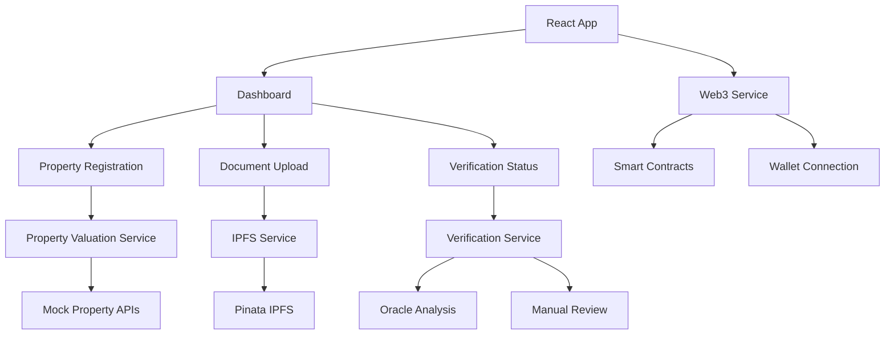

# 🏠 RealEstateX - Tokenized Real Estate Platform

[](https://opensource.org/licenses/MIT)
[](https://www.typescriptlang.org/)
[](https://reactjs.org/)
[](https://vitejs.dev/)

**RealEstateX** is a comprehensive decentralized application (dApp) for tokenizing real estate assets, featuring a stablecoin ($HOMED) backed by property collateral. The platform enables property owners to mint NFTs representing their real estate and generate stablecoins against their property value.

## 🎯 **Project Overview**

### **Core Features**
- 🏘️ **Property Tokenization** - Convert real estate into NFTs
- 💰 **$HOMED Stablecoin** - Property-backed stable cryptocurrency
- 📄 **IPFS Document Storage** - Decentralized document management
- 🔍 **Hybrid Verification** - AI Oracle + Manual review system
- 🔗 **Web3 Integration** - Full blockchain connectivity
- 📊 **Property Valuation** - Multi-source price estimation
- ⚡ **Fractional Ownership** - Buy/sell property fractions
- 🚨 **Liquidation System** - Risk management and alerts

### **Technology Stack**
- **Frontend**: React 18 + TypeScript + Vite
- **Styling**: Tailwind CSS + Headless UI
- **Web3**: wagmi + viem + Web3Modal
- **Storage**: IPFS via Pinata
- **Blockchain**: BlockDAG (Testnet)
- **State Management**: React Hooks + Context

## 📁 **Project Structure**

```
RealEstateX/
├── frontend/                    # React frontend application
│   ├── src/
│   │   ├── components/         # React components
│   │   │   ├── dashboard/      # Main dashboard
│   │   │   ├── property/       # Property management
│   │   │   ├── upload/         # Document upload
│   │   │   ├── verification/   # Verification status
│   │   │   └── wallet/         # Wallet integration
│   │   ├── services/           # Business logic services
│   │   │   ├── web3Service.ts        # Blockchain interactions
│   │   │   ├── ipfs.ts               # IPFS file storage
│   │   │   ├── verificationService.ts # Hybrid verification
│   │   │   └── propertyValuation.ts  # Property pricing
│   │   ├── config/             # Configuration files
│   │   ├── hooks/              # Custom React hooks
│   │   ├── utils/              # Utility functions
│   │   └── types/              # TypeScript definitions
│   ├── public/                 # Static assets
│   └── docs/                   # Component documentation
├── backend/                    # Python backend (FastAPI)
├── contracts/                  # Solidity smart contracts
└── docs/                       # Project documentation
```

## 🚀 **Quick Start**

### **Prerequisites**
- Node.js 18+ and npm
- MetaMask or compatible Web3 wallet
- Pinata account for IPFS storage

### **Installation**

1. **Clone the repository**
   ```bash
   git clone https://github.com/your-org/RealEstateX.git
   cd RealEstateX
   ```

2. **Install frontend dependencies**
   ```bash
   cd frontend
   npm install
   ```

3. **Environment setup**
   ```bash
   cp env.example .env
   # Edit .env with your configuration
   ```

4. **Start development server**
   ```bash
   npm run dev
   ```

5. **Access the application**
   - Open `http://localhost:5173`
   - Connect your Web3 wallet
   - Switch to BlockDAG testnet

### **Environment Variables**

```env
# IPFS Configuration
VITE_PINATA_JWT=your_pinata_jwt_token
VITE_PINATA_GATEWAY=https://gateway.pinata.cloud

# Blockchain Configuration  
VITE_BLOCKDAG_RPC_URL=https://rpc.blockdag.network
VITE_BLOCKDAG_CHAIN_ID=1043

# API Keys (for real estate data - optional)
VITE_PROPTIGER_API_KEY=your_api_key
VITE_HOUSING_API_KEY=your_api_key
```

## 🏗️ **Architecture Overview**

### **Frontend Architecture**



### **Data Flow**

1. **Property Registration Flow**
   ```
   User Input → Document Upload → IPFS Storage → Property Valuation → 
   Consent Signing → Verification Submission → Oracle Analysis → 
   Risk Assessment → Manual Review → Final Approval/Rejection
   ```

2. **Verification System Flow**
   ```
   Document Upload → Oracle Analysis (AI) → Risk Assessment → 
   Manual Review Queue → Human Decision → Final Status Update
   ```

## 📖 **Detailed Component Documentation**

### **🎛️ Core Services**

#### **1. Verification Service (`verificationService.ts`)**
The heart of the property verification system implementing a hybrid AI + human approach.

**Key Features:**
- 5-phase verification pipeline
- Mandatory manual review (no auto-approval)
- Risk assessment and compliance checking
- Queue management with priority levels

**Phases:**
1. **Document Upload** - IPFS storage completion
2. **Oracle Analysis** - AI document analysis with confidence scoring
3. **Risk Assessment** - Market analysis and compliance checks
4. **Manual Review** - Human expert evaluation (mandatory)
5. **Final Decision** - Human-only approval/rejection

#### **2. Property Valuation Service (`propertyValuation.ts`)**
Handles property value estimation using multiple data sources.

**Features:**
- Multi-source valuation (simulated APIs)
- Market trend analysis
- Location-based pricing
- Confidence scoring
- Minting potential calculation

#### **3. Web3 Service (`web3Service.ts`)**
Manages all blockchain interactions and smart contract calls.

**Features:**
- Property NFT minting
- $HOMED token operations
- User portfolio management
- Transaction handling

#### **4. IPFS Service (`ipfs.ts`)**
Handles decentralized file storage via Pinata.

**Features:**
- File upload to IPFS
- JSON metadata storage
- File retrieval and validation
- Progress tracking

### **🧩 React Components**

#### **1. Dashboard (`Dashboard.tsx`)**
Main application interface with multi-step flow management.

**Features:**
- Asset overview and statistics
- Property registration workflow
- Navigation between different flows
- Real-time data updates

#### **2. Property Registration (`PropertyRegistration.tsx`)**
Comprehensive property registration form with valuation and consent.

**Features:**
- Property details form
- Real-time valuation
- Message signing for consent
- Integration with verification system

#### **3. Verification Status (`VerificationStatus.tsx`)**
Real-time verification progress tracking with detailed phase information.

**Features:**
- Visual progress indicators
- Risk assessment display
- Manual review queue information
- Demo controls for testing

#### **4. Document Upload (`DocumentUpload.tsx`)**
Drag-and-drop file upload with IPFS integration.

**Features:**
- Multiple file formats support
- Progress tracking
- IPFS hash display
- Error handling

## 🔐 **Security Features**

### **Verification Security**
- **No Auto-Approval**: All properties require human review
- **Multi-Stage Validation**: Oracle + Risk Assessment + Manual Review
- **Document Integrity**: IPFS immutable storage
- **Risk Scoring**: Comprehensive risk factor analysis

### **Web3 Security**
- **Message Signing**: User consent verification
- **Wallet Integration**: Secure wallet connection
- **Transaction Safety**: Pre-flight validation
- **Network Verification**: Chain ID validation

## 🎨 **UI/UX Features**

### **Design System**
- **Tailwind CSS**: Utility-first styling
- **Responsive Design**: Mobile-first approach
- **Component Library**: Reusable UI components
- **Dark/Light Mode**: Theme support (planned)

### **User Experience**
- **Progressive Disclosure**: Step-by-step workflows
- **Real-time Feedback**: Live status updates
- **Error Handling**: Comprehensive error states
- **Loading States**: Smooth loading experiences

## 🧪 **Testing & Development**

### **Development Tools**
- **TypeScript**: Type safety and better DX
- **ESLint**: Code quality enforcement
- **Prettier**: Code formatting
- **Vite**: Fast development and building

### **Testing Approach**
- **Component Testing**: React component unit tests
- **Service Testing**: Business logic validation
- **Integration Testing**: End-to-end workflows
- **Mock Data**: Comprehensive test scenarios

## 🚀 **Deployment**

### **Build Process**
```bash
npm run build        # Production build
npm run preview      # Preview production build
npm run lint         # Code quality check
npm run type-check   # TypeScript validation
```

### **Deployment Options**
- **Vercel**: Automatic deployments from Git
- **Netlify**: Static site hosting
- **IPFS**: Decentralized hosting
- **Traditional**: Any static host

## 🔮 **Future Enhancements**

### **Phase 1 Completed ✅**
- Basic wallet integration
- Document upload to IPFS
- Property registration flow
- Hybrid verification system

### **Phase 2 In Progress 🚧**
- Enhanced verification with risk assessment
- Detailed progress tracking
- Improved UI/UX
- Better error handling

### **Phase 3 Planned 📋**
- Real smart contract integration
- Property fractionalization
- Marketplace functionality
- Liquidation system

### **Phase 4 Future 🔮**
- Multi-chain support
- Advanced analytics
- Mobile app
- Governance token

## 🤝 **Contributing**

We welcome contributions! Please see our [Contributing Guidelines](CONTRIBUTING.md) for details.

### **Development Workflow**
1. Fork the repository
2. Create a feature branch
3. Make your changes
4. Add tests and documentation
5. Submit a pull request

## 📄 **License**

This project is licensed under the MIT License - see the [LICENSE](LICENSE) file for details.

## 🆘 **Support**

- **Documentation**: `/docs` directory
- **Issues**: GitHub Issues
- **Discussions**: GitHub Discussions
- **Discord**: [Join our community](https://discord.gg/realestatex)

## 🙏 **Acknowledgments**

- **Pinata**: IPFS storage infrastructure
- **wagmi**: Excellent Web3 React hooks
- **Vite**: Lightning-fast development experience
- **BlockDAG**: Blockchain infrastructure

---

**Built with ❤️ by the RealEstateX Team**
