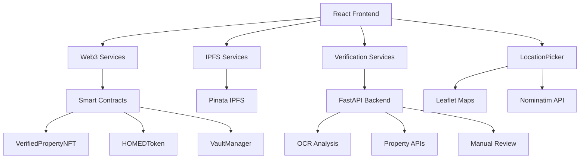
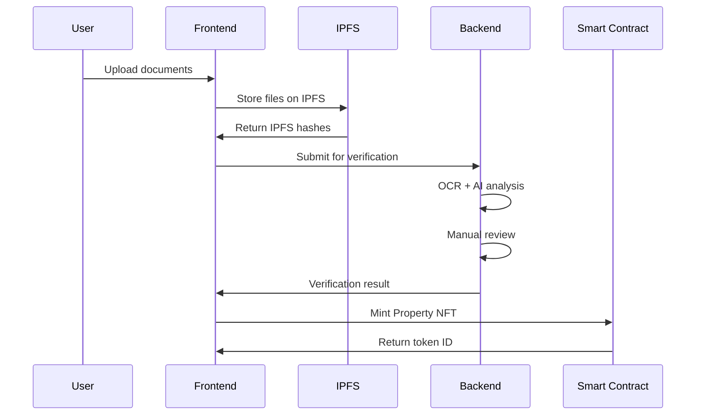
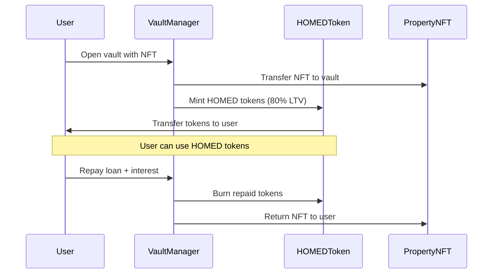

# 🏠 RealEstateX - Comprehensive Real Estate Tokenization Platform

[](https://opensource.org/licenses/MIT)
[](https://www.typescriptlang.org/)
[](https://reactjs.org/)
[](https://vitejs.dev/)
[](https://soliditylang.org/)
[](https://blockdag.network/)

**RealEstateX** is a cutting-edge decentralized application (dApp) that revolutionizes real estate investment by enabling property tokenization, stablecoin generation, and fractional ownership. The platform combines blockchain technology with AI-powered verification to create a secure, transparent, and accessible real estate investment ecosystem.

## 🌟 **Key Features**

### 🏘️ **Property Tokenization**
- Convert real estate assets into NFTs (VerifiedPropertyNFT)
- IPFS-based document storage for immutable property records
- Dynamic hash generation for unique property identification
- Smart contract-based ownership verification

### 💰 **$HOMED Stablecoin**
- Property-backed stable cryptocurrency
- 80% LTV (Loan-to-Value) ratio for conservative lending
- Vault-based collateral management system
- Automated minting and burning through smart contracts

### 🔍 **Hybrid Verification System**
- **AI Oracle Analysis**: Automated document verification using OCR and NLP
- **Risk Assessment**: Market analysis and compliance checking
- **Manual Review**: Mandatory human expert evaluation
- **No Auto-Approval**: All properties require human oversight

### 📊 **Advanced Features**
- **Interactive Geolocation Picker**: Leaflet-based map integration with real-time synchronization
- **Property Valuation**: Multi-source pricing with confidence scoring
- **Loan Management**: Repayment system with liquidation protection
- **Document Upload**: Drag-and-drop with IPFS integration

---

## 🏗️ **Architecture Overview**

### **Technology Stack**

#### **Frontend**
- **React 19.1.0** + **TypeScript** + **Vite** (Build tool)
- **Tailwind CSS** + **Headless UI** (Styling system)
- **wagmi** + **viem** + **Web3Modal** (Web3 integration)
- **React-Leaflet** + **OpenStreetMap** (Interactive maps)
- **Pinata SDK** (IPFS file storage)

#### **Backend**
- **FastAPI** (Python web framework)
- **PyTesseract** + **spaCy** (OCR and NLP processing)
- **Regrid API** (Real property data integration)

#### **Blockchain**
- **Solidity 0.8.26** (Smart contracts)
- **BlockDAG Testnet** (Deployment network)
- **Ethers.js 6.15.0** (Blockchain interaction)

#### **Storage & APIs**
- **IPFS via Pinata** (Decentralized storage)
- **OpenStreetMap Nominatim** (Geocoding services)
- **Regrid API** (Property database integration)

### **System Architecture**



---

## 📁 **Project Structure**

```
RealEstateX/
├── frontend/                    # React TypeScript application
│   ├── src/
│   │   ├── components/         # React components
│   │   │   ├── dashboard/      # Main dashboard and navigation
│   │   │   ├── property/       # Property management flows
│   │   │   │   ├── PropertyRegistration.tsx
│   │   │   │   ├── PropertyNFTMinting.tsx
│   │   │   │   └── CoordinatePropertyLookup.tsx
│   │   │   ├── upload/         # Document upload system
│   │   │   ├── verification/   # Verification status tracking
│   │   │   ├── wallet/         # Web3 wallet integration
│   │   │   ├── Repay/          # Loan repayment interface
│   │   │   └── LocationPicker.tsx  # Interactive map component
│   │   ├── services/           # Business logic layer
│   │   │   ├── contracts.ts    # Smart contract interactions
│   │   │   ├── web3Service.ts  # Blockchain operations
│   │   │   ├── ipfs.ts         # IPFS file management
│   │   │   ├── verificationService.ts  # Hybrid verification
│   │   │   ├── propertyValuation.ts    # Property pricing
│   │   │   └── regridService.ts        # Property data API
│   │   ├── abi/               # Smart contract ABIs
│   │   │   ├── VerifiedPropertyNFT_metadata.json
│   │   │   ├── HOMEDToken_metadata.json
│   │   │   └── VaultManager_metadata.json
│   │   ├── config/            # Configuration files
│   │   ├── hooks/             # Custom React hooks
│   │   ├── types/             # TypeScript definitions
│   │   └── utils/             # Utility functions
│   ├── docs/                  # Component documentation
│   └── public/                # Static assets
├── backend/                   # Python FastAPI backend
│   ├── verify_docs_fastapi.py # Document verification service
│   ├── requirements.txt       # Python dependencies
│   └── env/                   # Virtual environment
├── contracts/                 # Solidity smart contracts
│   ├── VerifiedPropertyNFT.sol    # Property NFT contract
│   ├── HOMEDToken.sol             # Stablecoin contract
│   └── VaultManager.sol           # Collateral management
└── README.md                  # This file
```

---

## 🚀 **Quick Start**

### **Prerequisites**
- **Node.js** 18+ and **npm**
- **Python** 3.8+ with **pip**
- **MetaMask** or compatible Web3 wallet
- **Git** for version control

### **Frontend Setup**

```bash
# Clone the repository
git clone https://github.com/prad18/RealEstateX.git
cd RealEstateX/frontend

# Install dependencies
npm install

# Create environment file
cp .env.example .env

# Configure environment variables
VITE_WALLET_CONNECT_PROJECT_ID=your_project_id
VITE_PINATA_JWT=your_pinata_jwt_token
VITE_PINATA_GATEWAY=your_pinata_gateway_url
VITE_REGRID_API_KEY=your_regrid_api_key
VITE_PROPERTYNFT_ADDRESS=property_nft_address
VITE_HOMEDTOKEN_ADDRESS=hometoken_address
VITE_VAULTMANAGER_ADDRESS=vaultmanager_address
VITE_ADMIN_PRIVATE_KEY=admin_account_metamask_privatekey
VITE_RPC_URL=RPC_URL_HERE
VITE_INFURA_PROJECT_ID=infura_api_key

# Start development server
npm run dev
```

### **Backend Setup**

```bash
# Navigate to backend directory
cd ../backend

# Create virtual environment
python -m venv env
source env/bin/activate  # Windows: env\Scripts\activate

# Install dependencies
pip install -r requirements.txt

# Configure environment variables
cp .env.example .env
# Add your REGRID_API_KEY and other settings

# Install Tesseract OCR
# Windows: Download from https://github.com/UB-Mannheim/tesseract/wiki
# macOS: brew install tesseract
# Linux: sudo apt-get install tesseract-ocr

# Install spaCy model
python -m spacy download en_core_web_sm

# Start FastAPI server
uvicorn main:app --reload --port 8000
```

### **Access the Application**
- **Frontend**: http://localhost:5173
- **Backend API**: http://localhost:8000
- **API Documentation**: http://localhost:8000/docs

---

## 🔗 **Smart Contracts**

### **Contract Addresses (BlockDAG Testnet)**

| Contract | Address | Purpose |
|----------|---------|---------|
| **VerifiedPropertyNFT** | `0x44Df877FE3e1121fA2Dfbaa4a3D5bEaE5a031a15` | Property tokenization |
| **HOMEDToken** | `0x6Fa1baFB83D83f94D6a42787533382abe3Db2f53` | Stablecoin contract |
| **VaultManager** | `0x4c1a40E5ba4E64436a77734f05Bc363fDf68ce9b` | Collateral management |

### **Smart Contract Features**

#### **VerifiedPropertyNFT.sol**
```solidity
// Key functions
function mint(address to, string calldata ipfsHash, uint256 valuation) external onlyOwner
function setVerified(uint256 tokenId, bool status) external onlyOwner
function getProperty(uint256 tokenId) external view returns (string memory, uint256, bool)
function getTokenIdsByOwner(address owner) external view returns (uint256[] memory)
```

#### **HOMEDToken.sol**
```solidity
// Key functions
function mint(address to, uint256 amount) external onlyVaultManager
function burn(address from, uint256 amount) external onlyVaultManager
function setVaultManager(address _vaultManager) external onlyOwner
```

#### **VaultManager.sol**
```solidity
// Key functions
function openVault(uint256 nftId) external
function repayAndCloseVault(uint256 nftId, uint256 amount) external
function getUserVaults(address user) external view returns (uint256[] memory)
```

---

## 🎯 **Core Workflows**

### **1. Property Registration Flow**



### **2. Loan Process Flow**



### **3. Verification System Phases**

1. **Document Upload** → IPFS storage completion
2. **Oracle Analysis** → AI-powered document verification
3. **Risk Assessment** → Market analysis and compliance
4. **Manual Review** → Human expert evaluation (mandatory)
5. **Final Decision** → Human-only approval/rejection

---

## 📖 **Key Components Documentation**

### **🗺️ LocationPicker Component**

Advanced geolocation picker with three synchronized input methods:

```typescript
<LocationPicker
  onChange={(location) => {
    console.log('Selected:', location);
    // { lat: 39.768623, lon: -86.158068, address: "..." }
  }}
  initialLocation={{
    lat: 39.7684,
    lon: -86.1581,
    address: 'Monument Circle, Indianapolis, IN, USA'
  }}
  className="w-full"
/>
```

**Features:**
- ✅ Address input with forward geocoding
- ✅ Coordinate inputs with reverse geocoding  
- ✅ Interactive map with click/drag markers
- ✅ Real-time synchronization between all inputs
- ✅ OpenStreetMap integration with Nominatim API
- ✅ Rate limiting (1 request/second) compliance

### **🎛️ Core Services**

#### **Web3Service (`web3Service.ts`)**
```typescript
// Property NFT operations
await web3Service.registerProperty(propertyData);
await web3Service.getUserProperties(userAddress);

// Token operations  
await web3Service.getTokenBalance(userAddress);
await web3Service.mintHomed(mintRequest);
```

#### **VerificationService (`verificationService.ts`)**
```typescript
// Submit property for verification
await verificationService.submitForVerification(
  propertyId, 
  documentHashes, 
  propertyMetadata
);

// Check verification status
const status = await verificationService.getVerificationStatus(propertyId);
```

#### **IPFSService (`ipfs.ts`)**
```typescript
// Upload files to IPFS
const result = await ipfsService.uploadFile(file);
const jsonResult = await ipfsService.uploadJSON(metadata);
```

### **🔒 Security Features**

#### **Verification Security**
- **No Auto-Approval**: All properties require human review
- **Multi-Stage Validation**: Oracle + Risk Assessment + Manual Review
- **Document Integrity**: IPFS immutable storage
- **Risk Scoring**: Comprehensive risk factor analysis

#### **Web3 Security**
- **Message Signing**: User consent verification
- **Wallet Integration**: Secure MetaMask connection
- **Transaction Safety**: Pre-flight validation
- **Network Verification**: Chain ID validation
- **Admin-Only Functions**: Protected minting and verification

---

## 🧪 **Testing & Development**

### **Development Commands**

```bash
# Frontend development
npm run dev          # Start development server
npm run build        # Build for production
npm run lint         # Run ESLint
npm run preview      # Preview production build

# Backend development
uvicorn verify_docs_fastapi:app --reload  # Start with hot reload
python -m pytest tests/                   # Run tests (if available)
```

### **Environment Configuration**

#### **Frontend (.env.local)**
```env
VITE_WALLET_CONNECT_PROJECT_ID=your_wallet_connect_project_id
VITE_PINATA_JWT=your_pinata_jwt_token
VITE_PINATA_GATEWAY=https://your-gateway.pinata.cloud
VITE_REGRID_API_KEY=your_regrid_api_key
VITE_BLOCKDAG_RPC_URL=https://rpc.blockdag.network
```

#### **Backend (.env)**
```env
REGRID_API_KEY=your_regrid_api_key
TESSERACT_PATH=C:\Program Files\Tesseract-OCR\tesseract.exe
```

### **Testing Workflow**

1. **Wallet Connection**: Connect MetaMask to BlockDAG testnet
2. **Property Lookup**: Use coordinate-based property search
3. **Document Upload**: Upload property documents and ID proof
4. **Verification**: Track progress through verification phases
5. **NFT Minting**: Mint property NFT after verification
6. **Vault Opening**: Open vault and mint HOMED tokens
7. **Loan Repayment**: Repay loan and retrieve NFT

---

## 🚀 **Deployment**

### **Frontend Deployment**

```bash
# Build for production
npm run build

# Deploy to Vercel/Netlify
# Upload dist/ folder to your hosting provider

# Environment variables needed:
# - VITE_WALLET_CONNECT_PROJECT_ID
# - VITE_PINATA_JWT
# - VITE_PINATA_GATEWAY
# - VITE_REGRID_API_KEY
```

### **Backend Deployment**

```bash
# Install production dependencies
pip install -r requirements.txt

# Deploy to Railway/Heroku/AWS
# Ensure Tesseract OCR is available on deployment platform

# Environment variables needed:
# - REGRID_API_KEY
# - TESSERACT_PATH (if custom)
```

### **Smart Contract Deployment**

```bash
# Using Hardhat or similar framework
npx hardhat compile
npx hardhat deploy --network blockdag-testnet

# Verify contracts on block explorer
npx hardhat verify --network blockdag-testnet <CONTRACT_ADDRESS>
```

---

## 📊 **Project Status**

### **✅ Completed Features**
- ✅ Complete Web3 wallet integration
- ✅ IPFS document storage with Pinata
- ✅ Interactive geolocation picker with maps
- ✅ Property registration workflow
- ✅ Hybrid verification system (AI + Manual)
- ✅ Smart contract integration (NFT, Token, Vault)
- ✅ Dynamic IPFS hash generation
- ✅ Loan management and repayment system
- ✅ Comprehensive error handling and loading states

### **🚧 In Progress**
- 🚧 Enhanced property valuation algorithms
- 🚧 Advanced verification workflow optimization
- 🚧 Mobile-responsive design improvements
- 🚧 Performance optimization and caching

### **📋 Planned Features**
- 📋 Marketplace for property fractionalization
- 📋 Advanced analytics dashboard
- 📋 Multi-chain support (Ethereum, Polygon)
- 📋 Mobile application (React Native)
- 📋 Real estate API integrations (Zillow, MLS)
- 📋 Governance token and DAO functionality

---

## 🤝 **Contributing**

We welcome contributions! Please follow these guidelines:

### **Development Workflow**
1. **Fork** the repository
2. **Create** a feature branch: `git checkout -b feature/amazing-feature`
3. **Commit** your changes: `git commit -m 'Add amazing feature'`
4. **Push** to the branch: `git push origin feature/amazing-feature`
5. **Submit** a pull request

### **Code Standards**
- **TypeScript**: Strict mode enabled
- **ESLint**: Follow provided configuration
- **Prettier**: Auto-format on save
- **Testing**: Add tests for new features
- **Documentation**: Update README and inline docs

### **Contribution Areas**
- 🐛 Bug fixes and optimizations
- ✨ New feature development
- 📚 Documentation improvements
- 🧪 Test coverage expansion
- 🎨 UI/UX enhancements

---

## 🔮 **Future Roadmap**

### **Phase 1: Enhanced Features** (Q2 2025)
- Advanced property analytics
- Improved verification algorithms
- Mobile application development
- Performance optimizations

### **Phase 2: Ecosystem Expansion** (Q3 2025)
- Multi-chain deployment (Ethereum, Polygon)
- Real estate marketplace
- Fractional ownership features
- Advanced liquidation mechanisms

### **Phase 3: Enterprise Integration** (Q4 2025)
- Enterprise-grade APIs
- Institutional investor features
- Regulatory compliance tools
- Advanced governance mechanisms

### **Phase 4: Global Expansion** (2026+)
- International property support
- Multi-currency stablecoins
- Cross-border investment features
- AI-powered market predictions

---

## 📄 **License**

This project is licensed under the **MIT License** - see the [LICENSE](LICENSE) file for details.

---

## 🆘 **Support & Documentation**

### **📚 Additional Documentation**
- **[Component Documentation](frontend/docs/README.md)** - Detailed component guides
- **[API Integration Guide](frontend/docs/API_INTEGRATION.md)** - External API setup
- **[Deployment Guide](frontend/docs/DEPLOYMENT.md)** - Production deployment
- **[Services Documentation](frontend/docs/SERVICES.md)** - Backend services
- **[LocationPicker Guide](frontend/docs/LocationPicker.md)** - Map component usage

### **🔗 Useful Links**
- **[BlockDAG Network](https://blockdag.network/)** - Blockchain platform
- **[Pinata IPFS](https://pinata.cloud/)** - Decentralized storage
- **[Regrid API](https://regrid.com/)** - Property data service
- **[OpenStreetMap](https://www.openstreetmap.org/)** - Map data provider

### **💬 Community & Support**
- **GitHub Issues**: Report bugs and request features
- **Discussions**: Community Q&A and ideas
- **Email**: support@realestatex.com (if available)

### **🙏 Acknowledgments**
- **OpenZeppelin** for secure smart contract templates
- **React Leaflet** for interactive mapping components
- **Pinata** for reliable IPFS storage
- **BlockDAG** for blockchain infrastructure
- **Regrid** for comprehensive property data

---

**Built with ❤️ by the Error 404 Team**

*Democratizing real estate investment through blockchain technology*
