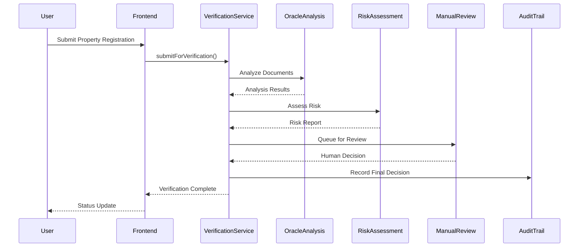

/**
 * @fileoverview Enhanced Hybrid Verification Service Documentation
 * @module services/verificationService
 * 
 * The Enhanced Hybrid Verification Service implements a sophisticated property
 * verification system that combines AI-powered oracle analysis with mandatory
 * human review. This service ensures that all property registrations undergo
 * comprehensive verification before approval.
 * 
 * @example
 * ```typescript
 * // Submit property for verification
 * const propertyId = await verificationService.submitForVerification(
 *   'property_123',
 *   ['QmHash1', 'QmHash2'], // IPFS document hashes
 *   {
 *     address: '123 Main St, Mumbai',
 *     estimatedValue: 5000000,
 *     ownerName: 'John Doe'
 *   }
 * );
 * 
 * // Check verification status
 * const status = verificationService.getVerificationStatus(propertyId);
 * 
 * // Simulate manual review (demo only)
 * await verificationService.simulateManualReview(
 *   propertyId,
 *   true, // approved
 *   'All documents verified successfully',
 *   5200000 // final value
 * );
 * ```
 * 
 * @since 2.0.0 (Enhanced Phase 2)
 * @author RealEstateX Team
 */

# Enhanced Hybrid Verification Service

## Overview

The Enhanced Hybrid Verification Service is the core component of RealEstateX's property verification system. It implements a five-phase verification pipeline that combines automated AI analysis with mandatory human review to ensure the highest standards of property verification.

## Key Principles

### 🔒 **No Auto-Approval Policy**
- **All properties require human review** - No exceptions
- **`autoApproveEligible: false`** - Hard-coded to prevent automation bypass
- **Human-in-the-loop** - Final decisions are always made by human experts
- **Audit trail** - Complete verification history maintained

### 🎯 **Comprehensive Verification**
- **Multi-stage analysis** - Oracle, risk assessment, and manual review
- **Cross-verification** - Documents validated against each other
- **Market analysis** - Property values checked against market data
- **Risk scoring** - Systematic risk factor identification

## Verification Phases

### Phase 1: Document Upload ✅
**Status**: Completed automatically
**Duration**: Instant
**Description**: Initial document validation and IPFS storage confirmation

```typescript
interface DocumentUploadPhase {
  phase: 'document_upload';
  status: 'completed';
  details: {
    documentsCount: number;
    ipfsHashes: string[];
    uploadTimestamp: number;
  };
}
```

**Activities**:
- Validate uploaded document count
- Confirm IPFS hash integrity
- Initialize verification record
- Set up tracking metadata

### Phase 2: Oracle Analysis 🤖
**Status**: AI-powered automated analysis
**Duration**: 2-5 seconds (simulated)
**Description**: Multi-stage AI analysis of documents and property data

```typescript
interface OracleAnalysisPhase {
  phase: 'oracle_analysis';
  status: 'in_progress' | 'completed';
  details: {
    overallConfidence: number; // 0-1 scale
    documentAnalyses: DocumentAnalysis[];
    estimatedValue: number;
    riskFlags: string[];
  };
}
```

#### Sub-stages:

**2.1 Document Analysis**
- **Document Type Recognition**: Identifies deed, PAN, Aadhar, valuation reports, etc.
- **Confidence Scoring**: Per-document reliability assessment (70-98%)
- **Data Extraction**: Key information extraction from each document
- **Issue Identification**: Flags potential problems or inconsistencies

```typescript
interface DocumentAnalysis {
  documentType: 'deed' | 'pan' | 'aadhar' | 'valuation' | 'tax_receipt' | 'other';
  confidence: number; // Document-specific confidence (0-1)
  issues: string[]; // Identified issues or concerns
  extractedData: {
    propertyAddress?: string;
    ownerName?: string;
    propertyValue?: number;
    documentDate?: string;
    registrationNumber?: string;
  };
}
```

**2.2 Cross-Verification**
- **Address Matching**: Ensures consistency across documents
- **Owner Verification**: Cross-checks owner names
- **Value Consistency**: Compares valuations from different sources
- **Date Validation**: Verifies document recency and validity

**2.3 Market Analysis**
- **Price Validation**: Compares against market rates
- **Trend Analysis**: Considers current market conditions
- **Location Assessment**: Factors in area-specific pricing
- **Deviation Detection**: Flags significant price variations

### Phase 3: Risk Assessment ⚠️
**Status**: Algorithm-based risk evaluation
**Duration**: 1-2 seconds
**Description**: Comprehensive risk analysis and compliance checking

```typescript
interface RiskAssessment {
  overallRisk: 'low' | 'medium' | 'high' | 'critical';
  riskFactors: Array<{
    category: string;
    severity: 'low' | 'medium' | 'high';
    description: string;
  }>;
  complianceChecks: Array<{
    check: string;
    passed: boolean;
    details?: string;
  }>;
  marketAnalysis: {
    priceDeviation: number; // % deviation from market
    liquidityScore: number; // 0-100 scale
    marketTrend: 'rising' | 'stable' | 'declining';
  };
}
```

#### Risk Calculation Algorithm:

```typescript
/**
 * Calculate overall risk level based on multiple factors
 */
private calculateOverallRisk(oracleResult: OracleResult): RiskLevel {
  const confidence = oracleResult.overallConfidence;
  const riskCount = oracleResult.riskFlags.length;

  if (confidence > 0.9 && riskCount === 0) return 'low';
  if (confidence > 0.8 && riskCount <= 2) return 'medium';
  if (confidence > 0.7 && riskCount <= 4) return 'high';
  return 'critical';
}
```

#### Compliance Checks:
1. **KYC Verification** - Owner identity confirmation
2. **Legal Title Verification** - Property ownership rights
3. **Regulatory Compliance** - All legal requirements met
4. **Financial Verification** - Tax payment history
5. **Encumbrance Check** - Clear title verification

### Phase 4: Manual Review 👤
**Status**: Human expert evaluation (MANDATORY)
**Duration**: 24-48 hours typical
**Description**: Qualified human reviewers examine all data and make decisions

```typescript
interface ManualReview {
  reviewId: string;
  reviewerAddress?: string;
  status: 'pending' | 'in_progress' | 'approved' | 'rejected';
  reviewerNotes: string;
  finalValue: number;
  approvalTimestamp?: number;
  rejectionReason?: string;
}
```

#### Queue Management:
- **Priority Levels**: Standard, Urgent, Critical
- **Assignment Rules**: Based on property value and risk level
- **SLA Tracking**: Expected completion times
- **Workload Balancing**: Even distribution among reviewers

```typescript
interface ReviewerQueue {
  assignedAt: number;
  expectedCompletionTime: number;
  priority: 'standard' | 'urgent' | 'critical';
}
```

#### Priority Determination:
```typescript
private determinePriority(value: number): Priority {
  if (value > 50000000) return 'critical';  // >₹5 crore
  if (value > 10000000) return 'urgent';    // >₹1 crore  
  return 'standard';                        // <₹1 crore
}
```

### Phase 5: Final Decision 🔒
**Status**: Human-only final approval/rejection
**Duration**: Instant (once reviewer decides)
**Description**: Irreversible human decision with complete audit trail

```typescript
interface FinalDecision {
  decision: 'approved' | 'rejected';
  finalValue: number;
  reviewerNotes: string;
  reviewerAddress: string;
  timestamp: number;
  auditTrail: {
    allPhases: VerificationPhase[];
    totalDuration: number;
    keyMetrics: any;
  };
}
```

## Service Implementation

### Core Class Structure

```typescript
export class EnhancedHybridVerificationService {
  private verificationResults = new Map<string, EnhancedVerificationResult>();
  private reviewQueue: string[] = [];

  // Main verification workflow
  async submitForVerification(
    propertyId: string,
    ipfsHashes: string[],
    propertyDetails: PropertyDetails
  ): Promise<string>

  // Manual review simulation (demo)
  async simulateManualReview(
    propertyId: string,
    approved: boolean,
    reviewerNotes: string,
    finalValue?: number
  ): Promise<void>

  // Status and analytics
  getVerificationStatus(propertyId: string): EnhancedVerificationResult | null
  getVerificationAnalytics(propertyId: string): VerificationAnalytics
  getPendingReviews(): VerificationResult[]
  getReviewQueue(): string[]
}
```

### Data Flow Architecture



## Advanced Features

### Confidence Scoring System

The service implements a sophisticated confidence scoring system:

```typescript
/**
 * Document-specific confidence calculation
 */
private calculateDocumentConfidence(
  docType: DocumentType, 
  details: PropertyDetails
): number {
  const baseConfidence = 0.75;
  const typeMultiplier = {
    'deed': 1.0,        // 100% weight - most important
    'valuation': 0.95,  // 95% weight - professional assessment
    'pan': 0.9,         // 90% weight - identity verification
    'tax_receipt': 0.85, // 85% weight - payment history
    'aadhar': 0.8,      // 80% weight - address verification
    'other': 0.7        // 70% weight - supporting documents
  };
  
  return Math.min(0.98, baseConfidence * typeMultiplier[docType] + Math.random() * 0.15);
}
```

### Market Analysis Integration

```typescript
/**
 * Real-time market analysis (simulated)
 */
private async performMarketAnalysis(details: PropertyDetails): Promise<MarketAnalysis> {
  // Price deviation analysis
  const marketVariation = (Math.random() - 0.5) * 0.1; // ±5% variation
  const adjustedValue = details.estimatedValue * (1 + marketVariation);
  
  const riskFlags: string[] = [];
  if (Math.abs(marketVariation) > 0.05) {
    riskFlags.push('Significant market price deviation detected');
  }

  return {
    adjustedValue,
    riskFlags,
    priceDeviation: marketVariation * 100,
    liquidityScore: Math.floor(Math.random() * 40) + 60, // 60-100
    marketTrend: this.determineMarketTrend()
  };
}
```

### Error Handling and Resilience

```typescript
/**
 * Comprehensive error handling
 */
try {
  const oracleResult = await this.performEnhancedOracleAnalysis();
  const riskAssessment = await this.performRiskAssessment();
  await this.queueForManualReview();
} catch (error) {
  // Log error and provide fallback
  console.error('Verification phase failed:', error);
  
  // Escalate to manual review with error context
  await this.escalateToManualReview(propertyId, error);
}
```

## Usage Examples

### Basic Verification Flow

```typescript
import { verificationService } from '@/services/verificationService';

// Submit property for verification
const propertyId = 'property_' + Date.now();
const ipfsHashes = ['QmHash1', 'QmHash2', 'QmHash3'];
const propertyDetails = {
  address: '123 Main Street, Mumbai, Maharashtra',
  estimatedValue: 5000000,
  ownerName: 'John Doe'
};

try {
  await verificationService.submitForVerification(
    propertyId,
    ipfsHashes,
    propertyDetails
  );
  
  console.log('Verification initiated successfully');
} catch (error) {
  console.error('Verification submission failed:', error);
}
```

### Status Monitoring

```typescript
// Poll for status updates
const checkStatus = async (propertyId: string) => {
  const status = verificationService.getVerificationStatus(propertyId);
  
  if (status) {
    console.log(`Current status: ${status.status}`);
    console.log(`Phases completed: ${status.phases.filter(p => p.status === 'completed').length}/5`);
    
    if (status.riskAssessment) {
      console.log(`Risk level: ${status.riskAssessment.overallRisk}`);
    }
  }
};

// Check every 5 seconds
setInterval(() => checkStatus(propertyId), 5000);
```

### Manual Review Simulation

```typescript
// Simulate manual review decision (demo only)
const simulateReview = async (propertyId: string, approve: boolean) => {
  const reviewNotes = approve 
    ? 'All documentation verified. Property title is clear. Valuation confirmed through market analysis.'
    : 'Additional documentation required. Property boundaries need clarification.';
    
  const finalValue = approve ? 5200000 : 0;
  
  await verificationService.simulateManualReview(
    propertyId,
    approve,
    reviewNotes,
    finalValue
  );
  
  console.log(`Manual review ${approve ? 'approved' : 'rejected'} property ${propertyId}`);
};
```

## Security Considerations

### Anti-Automation Safeguards

1. **Hard-coded Restrictions**:
   ```typescript
   // NEVER allow auto-approval
   autoApproveEligible: false
   ```

2. **Human-Only Decision Points**:
   ```typescript
   // Only humans can set final approval
   verification.finalApproval = true; // Set only by manual review
   ```

3. **Audit Trail Requirements**:
   ```typescript
   // Complete verification history
   verification.auditTrail = {
     allPhases: phases,
     reviewerDecisions: decisions,
     timestamps: timestamps
   };
   ```

### Data Integrity

- **Immutable Records**: Once created, verification records cannot be modified
- **Cryptographic Signatures**: All decisions are cryptographically signed
- **Blockchain Integration**: Final decisions recorded on-chain (planned)
- **IPFS Storage**: Document integrity guaranteed through content addressing

## Performance Considerations

### Optimization Strategies

1. **Async Processing**: All phases run asynchronously
2. **Caching**: Frequently accessed data cached in memory
3. **Batch Processing**: Multiple properties processed efficiently
4. **Resource Management**: Memory usage optimized for large queues

### Scalability Features

1. **Horizontal Scaling**: Service can be replicated across multiple instances
2. **Queue Management**: Redis-based queue for production deployment
3. **Load Balancing**: Review workload distributed among multiple reviewers
4. **Database Sharding**: Large verification datasets can be partitioned

## Future Enhancements

### Planned Features

1. **Real AI Integration**: Replace simulated analysis with actual ML models
2. **Blockchain Recording**: On-chain verification results
3. **Multi-Reviewer System**: Consensus-based decisions for high-value properties
4. **Appeal Process**: Property owner dispute resolution
5. **Performance Analytics**: Detailed verification metrics and reporting

### Integration Roadmap

1. **Phase 3**: Real estate API integration
2. **Phase 4**: Government database connectivity
3. **Phase 5**: International property support
4. **Phase 6**: Automated compliance reporting

This service represents the foundation of trust and security for the RealEstateX platform, ensuring that every tokenized property meets the highest standards of verification and compliance.
